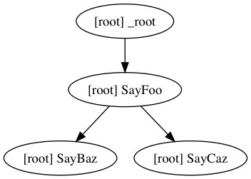

<h1 align="center">cr 📂  </h1>

<h5 align="center">The concurrent runner</h5>

<br/>


### Overview

`cr` is a job executor concerned with achieving the highest parallel execution possible.

Given a definition of jobs and their dependencies, it builds a graph that outlines the execution plan of these jobs.

For instance, consider the following plan:


```yaml
Jobs:
  - Id: 'SayFoo'
    Run: 'echo foo'

  - Id: 'SayBaz'
    Run: 'echo baz'
    DependsOn: [ 'SayFoo' ]

  - Id: 'SayCaz'
    Run: 'echo caz'
    DependsOn: [ 'SayFoo' ]
```

This plan states that we have 3 jobs to be executed: `SayFoo`, `SayBaz` and `SayCaz` but the last two jobs must only be executed after the first one and in case it succeeds. 

To visualize the execution plan we can run it with `--graph`, which validates the plan and prints out a [dot](https://en.wikipedia.org/wiki/DOT_(graph_description_language)) digraph.


```sh
# Execute CR telling it where the execution
# plan is (execution.yaml) and that it should
# just print the graph and exit.
cr --file ./execution.yaml  --graph

digraph {
	compound = "true"
	newrank = "true"
	subgraph "root" {
		"[root] SayFoo" -> "[root] SayBaz"
		"[root] SayFoo" -> "[root] SayCaz"
		"[root] _root" -> "[root] SayFoo"
	}
}

# If we pipe this to `dot` and than take the output
# of `dot` we can see the visual representation of the 
# digraph.

cr --file ./examples/hello-world.yaml --graph \
        | dot -Tpng > ./assets/hello-world.graph.png
```




